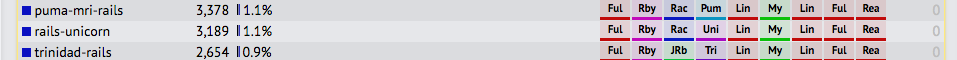

<!-- $theme: gaia -->

# Ruby ではなくGoLangを使う理由
# RJ Isao Aruga

---
# 概要
---
# rubyistクラスタの人が求めていること(主観です)
* 楽しくプログラムをしたい (matzもこれを目指している)
  - 簡単に余計なことを書かずに書ける
  - すぐ動かせる
  - (メタプログラミングを書きたい・・・？)

---
# Goだと
* rubyよりも書かなきゃいけないことは多いけど、その分安心して書けるぞ！
* コンパイル言語だけど、コンパイル速いしその場で実行もできるよ
* (メタプログラミングはやめよう)

---
# Goも良いよ

---
# 型 
* Ruby
  - 動的型付け
  - 型は書かない！Rubyの信念(matz談)
    - https://twitter.com/yukihiro_matz/status/773871448435720192

```ruby
str = "hello world"
print str
```

---
# 型
* Go
  - 静的型付け言語
  - 型推論はある

```go
var str = "hello world"
fmt.Println(str)
```
---
# コーディングスタイル
* Ruby
  - rubocopが一般的
    - 設定する項目が多すぎる
    - 設定値のデファクトがない？
    - 初期値の設定が厳しすぎてハゲる
  - RubyMineがやってくれたりもする

---
# コーディングスタイル
* Go
  - go fmt さいつよ。
    - go format に従うのが標準的
    - どのプロジェクト見ても同じなので見やすい。
    - 頭空っぽにして従えばいい

---
# 並行処理
* ruby
  * thread size 2mb
* Go
  * goroutine
    * stack size 10KB 軽量！ 
  * CSP(communicating sequential processes)
  * channel

---
# 標準ライブラリ (HTTP Server)
* ruby
こんな感じ？あんまり使ったことないです。
```
require 'webrick'
srv = WEBrick::HTTPServer.new({ :DocumentRoot => './',
                                :BindAddress => '127.0.0.1',
                                :Port => 8080})
srv.mount('/view.cgi', WEBrick::HTTPServlet::CGIHandler, 'view.rb')
trap("INT"){ srv.shutdown }
srv.start
```

---
# 標準ライブラリ (HTTP Server)
* go
これは簡単！！
```
http.HandleFunc("/", func(w http.ResponseWriter, r *http.Request) {
  fmt.Fprintf(w, "Hello, World")
})
log.Fatal(http.ListenAndServe("localhost:8000", nil))
```

---
# 標準ライブラリ (Parser)
* Ruby (JSON, XML, YAML 標準)
  簡単！
  ```
  require 'json'
  JSON.parse('{"foo":"bar"}')
  ```
  
---
* Go (JSON 標準)
  ハッシュとかにならないので、ちょっとめんどくさい
  ```
  type Sample struct {
    Id int
  }

  func main() {
    data := "{\"id\": 3}"
    v := Sample{}
    err := json.Unmarshal([]byte(data), &v)
    if err != nil {
      return
    }
    fmt.Println(v.Id)
  }  
  ```

---
# Test
test
coverage
example


---
# 実行環境
* Ruby
  - 環境ごとにバージョンにあわせたRubyをインストールしなければいけない
  - ビルドしてインストールして・・・rubyを消すときも作ったときのログを手がかりに消さないと・・・

* Go
  - Cross compiler
  - シングルバイナリで動作する

---
# 開発環境 (Editor)
* Ruby
  - Ruby Mine (有料: 基本はこれかなぁ)
  - Vim (あれこれ設定すると便利。最近使ってないのでわからんが、補完機能が微妙だった気がする。)
    - vimに慣れてない(Emacs派のことを言っているわけではない。Emacsでも開発できるのかもしれないけど知らない。)人からの敷居が高い
* Go
  - Atom
  - Vim (何回も書くが、Emacsは知らん！！)
  - IntelliJ?
  - Eclipse? (Eclipse使うならAtomでいい気がする。)
基本、fmtが標準であるから、何で書いてもいいんじゃないかなー
---
# 開発環境
* Ruby
  - rbenv で複数バージョン管理しながら使う

* Go
  https://github.com/moovweb/gvm#features
gvm pkgset create --local とすると、実行したディレクトリを gvm の package set にできます。
その後は、そのディレクトリ以下（サブディレクトリでもよい）で gvm pkgset use --local とすれば gvm がそのディレクトリを $GOPATH に設定してくれます。
違うバージョンを使う場合は gvm use go1.3.3 && gvm pkgset create --local として最初に local package set を作成すれば、次回からは gvm use go1.3.3 && gvm pkgset use --local とすれば切り替えられます。
---
# 実行速度
frame workごとに実行速度を比較したサイト
https://www.techempower.com/benchmarks/
Goの方が数十倍速い
* rails

* go


---
# Rubyの黒魔術
Rubyの黒魔術といえば、メタプログラミング。
メタプログラミングはRubyの特徴的な機能であり、うまく使うことで、Ruby on Railsなどが実装されている。
ただし、使い方を間違えれば、たちまち何を可読性が落ち、メンテナンスが不可能なコードが出来上がる可能性を秘めた素晴らしい機能である。
Go言語で言うと、reflectionがギリギリ親しい存在では有るが、Go言語はかなり制限されている。また、使用するときには十分考慮する必要がある。

---
# 黒魔術(オープンクラス)
既存のクラスを変更できる。
```ruby
foo = nil
if foo.nil?
  p "foo is nil"
else
  p "foo is not nil"
end
#=> foo is nil
```
---
# 黒魔術(オープンクラス)
NilClassを変更してやるぞ！！！
```ruby
class NilClass
  def nil?
    false
  end
end
```
NilClassなのに、nil?(nilの場合trueを返すメソッド)でfalseを返すようにしてみた

---
# 黒魔術(オープンクラス)
同じことをしてみる
```ruby
foo = nil
if foo.nil?
  p "foo is nil"
else
  p "foo is not nil"
end
#=> foo is not nil
```
すごい・・・！！※ 極端な一例です

---
# 黒魔術(method_missing)
メソッドがないからって、メソッドが実行されないなんて誰も言っていない。(ほんまか？)
```ruby
class MissingObj
  def method_missing(method_name, *args)
    p "#{method_name} #{args.join(',')}"
  end
end
foo = MissingObj.new
foo.hello("world")
#=> hello world
```
メソッドの定義元ジャンプとかも出来ないんで、辛い。ほんまつらい。

---
# 黒魔術(特異メソッド)
```ruby
foo = "foo"
def foo.bar
  "bar"
end
p foo.bar
#=> bar
p "bar".bar
#=> Error
```

---
# 黒魔術
紹介したのはほんの一部です。
rubyは怖い言語ですね。

---
# Reflection
Go のリフレクションの話を書き足したい。
---
# Shall we Go?
---
---
# Frame Work
* Ruby
  - Ruby on Rails

* Go
  - Echo, Gin , etc...
